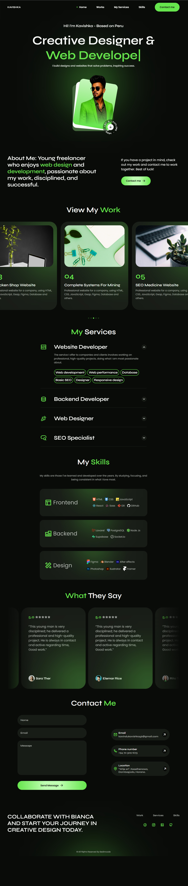

# 💼 Personal Portfolio Website

A modern, fully responsive personal portfolio website built using **HTML5, CSS3, and JavaScript**. This portfolio showcases my skills, projects, services, and contact information with smooth animations and an interactive user experience.

---

## 🚀 Live Demo

🔗 https://kavishka000.github.io/Portfolio-Website/

> Replace the above link with your GitHub Pages or Netlify deployment.

---

## 📸 Preview




---

## ✨ Features

- 🎨 Modern UI/UX Design
- 📱 Fully Responsive Layout
- ⚡ Smooth Scrolling Navigation
- 🖱️ Custom Animated Cursor
- ⌨️ Typing Text Animation
- 🎞️ ScrollReveal Animations
- 🎠 Swiper Project Slider
- 📂 Portfolio Showcase
- 💼 Services Section
- 🛠 Skills Section
- 💬 Testimonials Slider
- 📧 Contact Form using EmailJS
- 🔥 Clean and Organized Code

---

## 🛠 Built With

- HTML5
- CSS3
- JavaScript (ES6)
- ScrollReveal.js
- Swiper.js
- Typed.js
- EmailJS
- Remix Icons
- Google Fonts

---

## 📂 Project Structure

```
Portfolio-Website-main/
│
├── index.html
├── assets/
│   ├── css/
│   │   └── styles.css
│   ├── js/
│   │   └── main.js
│   ├── img/
│   
│
└── README.md
```

---

## ⚙️ Installation

Clone the repository

```bash
git clone https://github.com/Kavishka000/Portfolio-Website.git
```

Go to the project folder

```bash
cd Portfolio-Website-main
```

Open `index.html` in your browser.

---

## 📧 Contact

**Kavindu Kavishka Wijemanna**

Email:
kavindukavishka56@gmail.com

GitHub:
https://github.com/Kavishka000

Phone No:
+9470 309 1673

---

## 📄 License

This project is open-source and available under the MIT License.

---

## ⭐ Support

If you like this project, don't forget to give it a ⭐ on GitHub.
